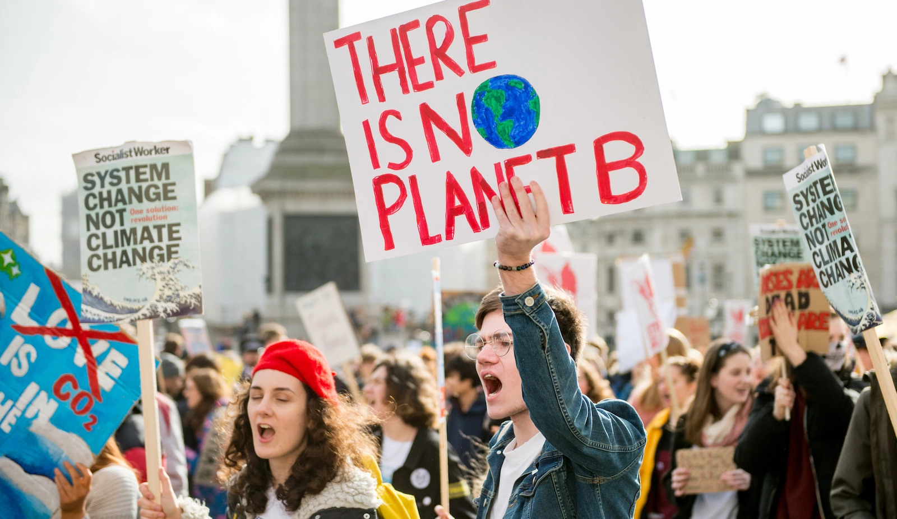

# EDSA : Climate Change Belief Analysis using Twitter

Ollie Millington / Getty Images

# Introduction

Climate change is a global phenomenon that involves ongoing changes in average temperatures and weather patterns.
Extreme weather events and catastrophes emanating from global warming such as hurricanes, floods and fires, have a direct impact on 70% of all economic sectors worldwide.

Many business leaders are now acknowledging the business imperative of climate change and increasingly understand it to be an existential threat that has far-reaching consequences for their people and business operations. An increasily warmer planet creates a wide range of risks for businesses, from disrupted supply chains to rising insurance costs and labor challenges.

This new reality has forced many companies to explore ways to lessening their environmental impact and carbon footprint through offering products and services that are environmentally friendly, sustainable, and in line with their values and ideals. 

Social media is a powerful source of information on a wide range of topic. Data from popular social media platforms such as twitter can be harvested and analyzed to find trends related to specific topics,measure poplular sentiment,obtain feedback on past decison and also help shape future decision.  

# Problem Statement
The aim of this project is to gauge the public perception of climate change using twitter data. This will help companies to: 
* Access a broad base of consumer sentiments, and insights in order to inform future marketing strategies.
* Gain insights on people's views and perceptions about climate change. 
* Improve market research efforts for companies that provide environmentally-friendly products and services.
* Strengthen efforts to reduce carbon footprint.   

# Objective
* Build a Machine Learning model that is able to classify whether or not aperson believes in climate change, based on their novel tweet data
* Provide a accurate robust solution that gives companies access to a broad base of customer sentiments,thus increasing their insights and informing future marketing strategies. 
* Achieve a Macro F1-score higher than 0.70.
*  Build an App using Streamlit's open-source app framework.
*  Host app within an AWS EC2 instance.
*  Use Comet alternate version control methods for experiments. 

# Data Source
* The collection of this data was funded by a Canada Foundation for Innovation JELF Grant to Chris Bauch, University of Waterloo. 
* The dataset aggregates tweets pertaining to climate change collected between Apr 27, 2015 and Feb 21, 2018 
* In total, <b>43,943</b> tweets were collected. 
* Each tweet is labelled as one of 4 classes.
* 2 News: the tweet links to factual news about climate change
* 1 Pro: the tweet supports the belief of man-made climate change
* 0 Neutral: the tweet neither supports nor refutes the belief of man-made climate change.
* -1 Anti: the tweet does not believe in man-made climate change Variable definitions

# Tools
* Kaggle
* Comet
* Streamlit

